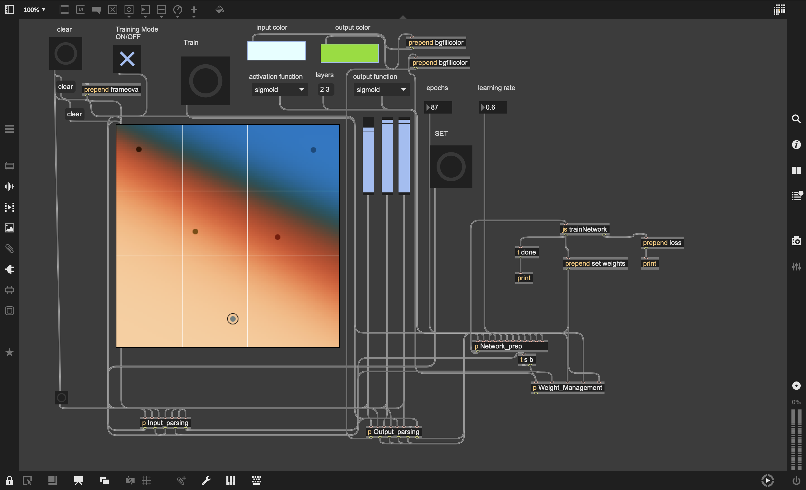

# 🧠 NeuroPatch (Neural Network from Scratch in Max/MSP)

This project is a **learning tool** for understanding how neural networks work — built entirely from scratch in the **Max/MSP JavaScript environment** (ES5 only, no external libraries).

---

## ✨ Highlights

- Customizable **feedforward neural network**
- Manual **matrix math** and **backpropagation**
- Multiple activation functions: Sigmoid, Softplus, Tanh, SiLU
- Interactive UI with sliders and dropdowns
- Real-time **LCD color visualization** of output
- Built entirely without external ML libraries

---

## 🎓 Built for Learning

- Understand how layers, weights, and gradients interact
- Watch learning unfold live through color-based output
- Explore the effects of different activation functions
- Experiment with architecture, learning rate, and epochs

---

## ⚠️ Technical Notes

Max’s JS object only supports:
- **ECMAScript 5** (no modern JS features)
- **No `import` or external libraries**

All math (dot product, transpose, element-wise ops, etc.) is implemented manually.

---

## 📂 Files

- `trainNetwork.js` – Training logic (incl. gradient descent)
- `runNetwork.js` – Inference logic
- `.maxpat` – Max/MSP patch with UI and visualization

---

## 🛠️ Requirements

- Max 8 or higher
- No external dependencies

